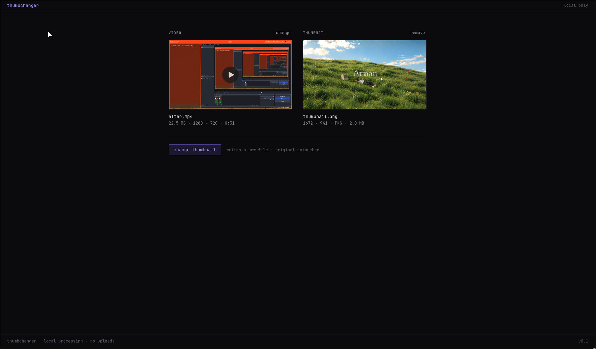

<p align="center">
  
</p>

<h4 align="center">
  <a href="https://github.com/kaihere14/videonail">Repository</a> |
  <a href="docs/about.md">Product Doc</a> |
  <a href="web/README.md">Web UI</a>
</h4>

<p align="center">
  <a href="https://www.rust-lang.org"></a>
  <a href="https://webassembly.org"></a>
  <a href="https://react.dev"></a>
  <a href="https://www.typescriptlang.org"></a>
</p>

ThumbChanger changes the embedded cover artwork of an MP4 without re-encoding the video or
audio. It rewrites the container metadata and leaves every media byte where it was.

A typical tool says:

`Re-encoding... 14 minutes remaining`

ThumbChanger says:

`✓ Media data unchanged (1 mdat box, 1.8 GB)`

It ships as a CLI and as a browser app. Both run the same Rust core; in the browser it is
compiled to WebAssembly and the file never leaves your machine.

## Why this exists

Changing a video's thumbnail usually means opening a video editor or an online converter. Both
re-encode the whole file: slow, lossy, and often capped at a few hundred megabytes. An MP4's
cover image is a small metadata box (`moov/udta/meta/ilst/covr`). Replacing it should be a
metadata edit, not a transcode.

## How it works

1. Scan the top-level boxes (`ftyp`, `moov`, `mdat`, ...). Only headers are read.
2. Load `moov` into memory — the only part of the file that ever is.
3. Rebuild `moov` with the new `covr`, creating `udta/meta/ilst` if missing. Every other byte
   of `moov` is copied verbatim.
4. Absorb the size change without touching `mdat`: if `moov` is the last box, nothing moves; if
   a `free` box follows, resize it; if `moov` shrank, insert a `free` box; otherwise shift the
   tail and patch every `stco`/`co64` entry.
5. Write the output as a list of segments: byte ranges copied from the input plus the new bytes.
6. Verify before handing anything over: every `mdat` payload hashes identically, the output
   `moov` parses with exactly one `covr` of the expected size, every chunk offset equals the
   input offset plus what the plan says, and the output length matches.

If verification fails, the output is discarded. The input is never modified in place.

```
MP4
├── Container metadata
│   └── Cover artwork      ← replaced
├── Video stream           ← untouched
├── Audio stream           ← untouched
└── Media data             ← untouched
```

## CLI

```bash
thumbchanger input.mp4 --thumbnail cover.jpg
thumbchanger input.mp4 --thumbnail cover.png --output out.mp4
```

Without `--output` the result is written next to the input as `<stem>-thumbchanged.mp4`.

```
✓ Media data unchanged (1 mdat box, 137398 bytes)
✓ Chunk offsets consistent (181 entries)
✓ Embedded artwork added (Jpeg, 44894 bytes)
✓ MP4 structure valid (moov +44918 bytes, moov is last box, mdat untouched)
✓ Verification passed
```

## Browser

The web app in [`web/`](web) is the same pipeline running client-side. The browser owns file
IO: it scans the box headers, copies only `moov` and the image into WebAssembly memory, and asks
the core for a plan. The output is a `Blob` assembled from slices of the original `File` plus
the rewritten `moov`, so a multi-gigabyte video costs no memory and is never uploaded. The same
verification runs before the download button appears.

Browser output is byte-identical to CLI output.

## Getting started

You need a Rust toolchain. For the web app, also [pnpm](https://pnpm.io) and the wasm target.

```bash
git clone https://github.com/kaihere14/videonail.git
cd videonail

# CLI
cargo build --release
./target/release/thumbchanger input.mp4 --thumbnail cover.jpg

# Web
rustup target add wasm32-unknown-unknown
cd web
pnpm install
pnpm build:wasm
pnpm dev
```

Open [http://localhost:5173](http://localhost:5173).

## Scripts

```bash
cargo build --release   # build the CLI
cargo test              # unit tests + FFmpeg round-trip tests (skipped if ffmpeg is missing)
cargo clippy            # lints

cd web
pnpm build:wasm         # rebuild src/wasm/thumbchanger.wasm from the Rust core
pnpm dev                # dev server
pnpm build              # type-check + production bundle
pnpm lint               # oxlint
```

## Layout

```
src/
├── main.rs, cli.rs      CLI
├── lib.rs               core library
├── wasm.rs              C-ABI exports for the browser (no wasm-bindgen)
└── mp4/
    ├── box_header.rs    ISO-BMFF box headers, 64-bit and size==0 variants
    ├── parser.rs        top-level scan
    ├── finder.rs        locate covr / stco / co64 / mvex inside moov
    ├── artwork.rs       JPEG/PNG sniffing, covr box serialization
    ├── rebuild.rs       in-memory moov rewrite
    ├── planner.rs       decide how the size change is absorbed
    ├── writer.rs        stream segments to <output>.part, verify, rename
    └── verify.rs        post-write checks
tests/roundtrip.rs       end-to-end against FFmpeg-generated files
web/                     React + TypeScript UI, see web/README.md
docs/about.md            product context and scope
```

## Limits

- MP4/M4V only. Fragmented MP4 (`moof`, `sidx`, `mvex`) is refused.
- JPEG and PNG artwork, detected by magic bytes.
- `stco` tables that would overflow 32 bits after a shift are refused rather than converted to
  `co64`.
- "Thumbnail" is not universal. ThumbChanger sets the embedded cover artwork; whether a given
  file manager or player displays it, or a frame instead, is up to that application.

## Built with

[Rust](https://www.rust-lang.org) with [clap](https://docs.rs/clap) and
[anyhow](https://docs.rs/anyhow) for the core and CLI; hand-written ISO-BMFF handling, no MP4
library; [React](https://react.dev), TypeScript, and [Vite](https://vite.dev) for the web app;
WebAssembly through a plain C ABI, no bindgen. FFmpeg is used only by the test suite.

## Product direction

ThumbChanger is a utility, not a media platform: no transcoding, no format conversion, no
uploads, no accounts. See [`docs/about.md`](docs/about.md) for the full product context, open
questions, and scope principles.
